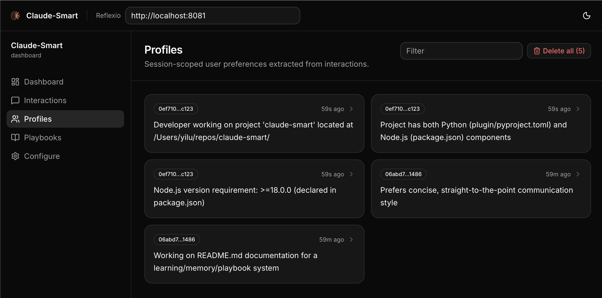
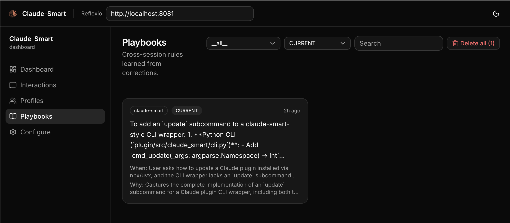

<p align="center">
  
</p>

<h1 align="center">
  claude-smart
</h1>

<h4 align="center">The <a href="https://claude.com/claude-code" target="_blank">Claude Code</a> plugin that makes Claude Code self-improve as you use it — not by remembering past sessions, but by turning your corrections into rules it actually follows next time.</h4>

<p align="center">
  <a href="LICENSE">
    
  </a>
  <a href="plugin/pyproject.toml">
    
  </a>
  <a href="plugin/pyproject.toml">
    
  </a>
  <a href="package.json">
    
  </a>
  <a href="#quick-start">
    
  </a>
</p>

<p align="center">
  <a href="#quick-start">Quick Start</a> •
  <a href="#how-it-works">How It Works</a> •
  <a href="#slash-commands">Slash Commands</a> •
  <a href="#dashboard">Dashboard</a> •
  <a href="#configuration">Configuration</a> •
  <a href="#troubleshooting">Troubleshooting</a> •
  <a href="#license">License</a>
</p>

<p align="center">
  It learns both corrections and successful execution patterns—so Claude Code avoids repeating mistakes and reuses what works. Instead of repeatedly explaining your stack, conventions, preferences, or the same gotchas, Claude Code steadily adapts to <i>how you like</i> to work—across projects, codebases, and sessions.
</p>

<p align="center">
  <b>Head-to-head vs <code>claude-mem</code></b>, evaluated by an LLM on how well each system’s reinjected context matched the expected rule: claude-smart achieved <b>~2.7× higher overall accuracy</b>, is better at <b>preventing Claude Code from repeating mistakes you have already corrected</b> rather than merely recalling that those mistakes happened, and is <b>3× better at converting past events into future-facing rules</b> — see <a href="benchmarks/memory_comparison/EXPERIMENT.md">EXPERIMENT.md</a> for details.
</p>
---

## Why Learning, Not Memory

Most memory solutions re-inject transcripts or summaries from prior sessions, but it is still mostly informative—Claude remembers what happened, without necessarily changing what it does next.

`claude-smart` focuses on learning instead.

Four ways this changes what Claude Code can do for you:

- **Actionable, not just informative:** Produces rules Claude can follow next time; memory only records what happened; 

  > *Example:* you tell Claude to stop running `npm test` without `--run` because watch mode hangs.
  > **Memory:** “user was annoyed about npm test hanging”
  > **Learning:** “always pass `--run` to `npm test` in this repo — default watch mode blocks CI”

- **Optimized paths, not just past events:** Preserves successful execution paths so Claude can reuse what already works.
  > *Example:* Claude spends several iterations trying to start the local dev environment before discovering that this repo requires `pnpm dev:all` instead of the usual `npm run dev`.
  > **Memory:** “user mentioned that `npm run dev` did not work”
  > **Learning:** “for this repo, always use `pnpm dev:all` to start the full local stack — `npm run dev` only starts the frontend and causes missing service errors”  

  Instead of re-exploring the same setup problem next time, Claude starts from the proven path—reducing planning steps, latency, and token usage.

- **Project-wide, not session-siloed:** Session memory disappears with the conversation. The project playbook persists and improves across every session in that repo.

- **Compact:** Distilled, deduplicated rules stay in dozens of tokens—not thousands—even as the project grows.

claude-smart turns corrections and successful execution patterns into two artifacts:

- **User Profile** → your preferences and working style across sessions
- **Project Playbook** → durable rules and optimized execution paths for how Claude should behave

Both are automatically reinjected at the start of every session, so Claude Code gets better the more you use it.

---

## Quick Start

```bash
npx claude-smart install     # or: uvx claude-smart install
```

Or run the equivalent marketplace commands directly inside Claude Code:

```text
/plugin marketplace add ReflexioAI/claude-smart
/plugin install claude-smart@reflexioai
```

Then restart Claude Code.

To uninstall: `/plugin uninstall claude-smart@reflexioai`.

Developing the plugin itself? See [DEVELOPER.md](./DEVELOPER.md#developing-locally).

---

## Key Features

- 🧠 **Learn, don't just remember** — Corrections become structured, deduplicated rules, not transcript replays.
- ⚡ **Fully automatic learning** — Every user turn, tool call, and assistant response is captured via lifecycle hooks and extracted into rules without you running anything.
- 📈 **Compounds with every session** — Rules auto-merge, supersede, and archive as your project evolves — the playbook sharpens with use instead of bloating.
  > *e.g.* you correct the same `npm test --run` gotcha twice → **claude-smart** consolidates them into one stronger rule. Later you switch the policy to `pnpm test` → the old rule is archived and the new one supersedes it, no manual cleanup.
- 🎯 **Two-tier scope** — Per-session profiles for the current conversation; cross-session playbooks for the whole project.
- 🔌 **No external API call** — semantic search runs on an in-process ONNX embedder (all-MiniLM-L6-v2), and all data (profiles, playbooks, interaction buffers) is stored locally on your machine (`~/.reflexio/` and `~/.claude-smart/`).
- 🔎 **Hybrid search** — Playbooks and profiles are indexed with vector + BM25 search for fast, robust retrieval.
- 🧪 **Offline resilience** — If the reflexio backend is down, hooks buffer to disk; the next successful publish drains them.
- 🧰 **Manual correction tag** — `/claude-smart:tag` flags the last turn as a correction so the extractor weights it heavily.

---

## Dashboard

A Next.js web UI lives in [`plugin/dashboard/`](plugin/dashboard/) for browsing session buffers, inspecting user profiles, and editing project playbooks. It auto-starts alongside the backend — just open **http://localhost:3001**.

<p align="center">
  
  
</p>

---

## How It Works

claude-smart builds two artifacts as you work and injects them into Claude at the start of every new session:

- **User profile** — session-scoped preferences (stack, role, small quirks). *e.g.* "uses pnpm, not npm"; "prefers terse answers"; "backend engineer — explain frontend with backend analogues."
- **Project playbook** — durable, generalized rules accumulated across every session in the repo. Each says when it applies and why. *e.g.* "always pass `--run` to `npm test` — watch mode hangs CI"; "use real Postgres for integration tests — mocks once hid a broken migration."

Rules clean themselves up: correct the same thing twice and they merge; change your mind and the old one is archived.

Under the hood: hooks watch your turns, tool calls, and Claude's replies, auto-flagging corrections (or anything you `/tag`). At session end (or on `/learn`), [reflexio](https://github.com/ReflexioAI/reflexio) — the self-improving engine that powers claude-smart — extracts profile entries and playbook rules. Next session, both get injected into the system prompt — run `/show` to see what Claude is being told. Everything runs on your machine.

See [ARCHITECTURE.md](./ARCHITECTURE.md) for hooks, data flow, and reflexio details.

---

## Slash Commands

| Command | What it does |
| --- | --- |
| `/show` | Print the current project playbook plus the current session's user profiles (same markdown that `SessionStart` injects). Use it to audit what rules and preferences Claude is being told to follow. |
| `/learn` | Force reflexio to run extraction *now* on the current session's unpublished interactions. Without this, extraction runs at the end of the session or on reflexio's batch interval. |
| `/tag [note]` | Tag the most recent turn as a correction, for cases the automatic heuristic missed. The note becomes the correction description the extractor sees. |
| `/restart` | Restart the reflexio backend and dashboard to pick up new changes (e.g. after upgrading the plugin or editing local reflexio code). |
| `/clear-all` | **Destructive.** Delete *all* reflexio interactions, profiles, and user playbooks. Use when you want to wipe learned state and start fresh. |

---

## Configuration

Advanced users can tune claude-smart via environment variables — see [DEVELOPER.md](./DEVELOPER.md#environment-variables) for the full list.

### Where data lives

| Path | What |
| --- | --- |
| `~/.reflexio/data/reflexio.db` | Source of truth — profiles, user_playbooks, interactions, FTS5 indexes, and vec0 embedding tables (plus `.db-shm` / `.db-wal` WAL sidecars). Inspect with `sqlite3`. |
| `~/.reflexio/.env` | Provider config — `CLAUDE_SMART_USE_LOCAL_CLI`, `CLAUDE_SMART_USE_LOCAL_EMBEDDING`, any optional API keys. |
| `~/.claude-smart/sessions/{session_id}.jsonl` | Per-session buffer. User turns, assistant turns, tool invocations, `{"published_up_to": N}` watermarks. Safe to inspect and safe to delete — everything past the latest watermark has already been written to reflexio's DB. |
| `~/.cache/chroma/onnx_models/all-MiniLM-L6-v2/` | Cached ONNX weights (~86 MB, downloaded once). Delete to force a re-download. |

### Embeddings

claude-smart uses an in-process ONNX embedder (Chroma's `all-MiniLM-L6-v2`, 384-dim, zero-padded to reflexio's 512-dim schema). The model weights are downloaded on first use (~80 MB, cached under `~/.cache/chroma/onnx_models/`) — after that, no network calls for embedding. Runtime cost is a few milliseconds per short document on CPU.

If you still want to use a cloud embedding provider (OpenAI, Gemini, etc.), omit `CLAUDE_SMART_USE_LOCAL_EMBEDDING` and set the corresponding API key in `~/.reflexio/.env` — reflexio will fall back to its standard provider-priority chain.

---

## Troubleshooting

**SessionStart injects nothing after a correction.**
Extraction is async by default. Run `/learn` to force it, wait ~20–30s, then run `/show` — no new session needed. `/show` shows whether the rule was actually extracted.

**Reflexio refuses to boot with "no embedding-capable provider".**
Check that `CLAUDE_SMART_USE_LOCAL_EMBEDDING=1` is in `~/.reflexio/.env` *and* that `chromadb` is installed in the venv (`uv run --project plugin python -c "import chromadb"` should print nothing). If you'd rather use a cloud embedder instead, drop the env flag and set `OPENAI_API_KEY` or `GEMINI_API_KEY` in the same file.

**`claude-smart` doesn't see my interactions.**
Check `~/.claude-smart/sessions/`. If your current session's JSONL has no `User`/`Assistant` rows, the plugin isn't receiving hook events — verify `.claude/settings.local.json` has the right path and that `enabledPlugins` is `true`.

**Hooks appear to time out.**
Each hook is capped at 15–60s. If you see long pauses, check `uv` is on PATH (hooks shell out to `uv run`). Set `CLAUDE_SMART_CLI_TIMEOUT=180` to give the LLM provider more headroom.

**A different LLM is being used.**
Reflexio's provider priority is `claude-code > local > anthropic > gemini > ... > openai`. If you have `CLAUDE_SMART_USE_LOCAL_CLI=1` *and* an Anthropic key set, claude-code still wins for generation; `local` sits above openai/gemini for embeddings. Check the startup log line `Primary provider for generation: <name>` and `Embedding provider: <name>` to confirm.

**I want to wipe everything and start over.**
```bash
rm -rf ~/.claude-smart/sessions/
rm -rf ~/.reflexio/data/           # reflexio SQLite store
```

---

## License

This project is licensed under the **Apache License 2.0**. The bundled `reflexio/` submodule is also Apache 2.0. Claude Code is Anthropic's and not covered by this license.

See the [LICENSE](LICENSE) file for details.

---

## Support

- **Issues**: open one on GitHub describing the symptom and include the reflexio backend log (`~/.claude-smart/backend.log`) and the relevant lines of `~/.claude-smart/sessions/{session_id}.jsonl`.

---

**Built on** [reflexio](https://github.com/ReflexioAI/reflexio) · **Runs on** [Claude Code](https://claude.com/claude-code) · **Written in** Python 3.12+
